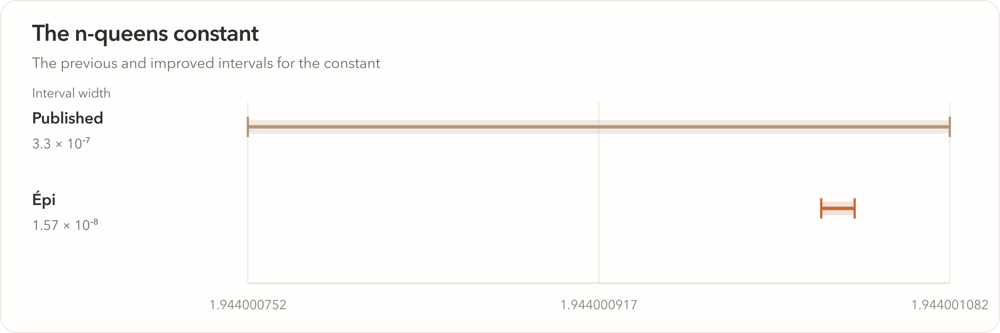
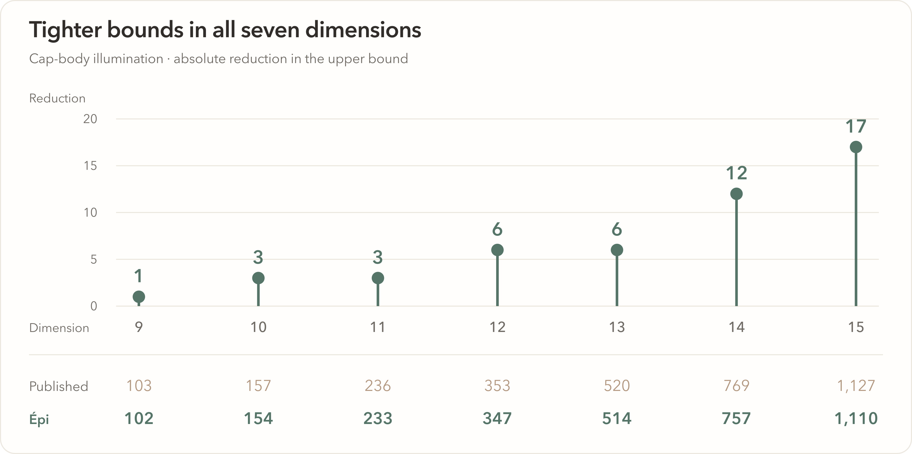

<p align="center">
  
</p>

<h1 align="center">Épi Results</h1>

<p align="center">Final constructions. Sharper bounds. Mathematical certificates.</p>

<p align="center">
  <a href="#construction-records">Constructions</a> ·
  <a href="mathematics">Mathematics</a> ·
  <a href="#downloads">Downloads</a> ·
  <a href="#citation">Citation</a> ·
  <a href="https://howiehwong.github.io/epi/blog/introducing-epi.html">Introducing Épi</a>
</p>

Épi is Bake AI’s research harness. This collection brings together **106 improved constructions** and **15 mathematical results**, spanning geometric packing, combinatorics, optimization, statistical mechanics, and quantum information.

Each entry contains the final result, its published comparison and source, and the construction or certificate. Larger certificates are available as separate downloads.

## Selected results

| Problem | Previous bound or construction | Épi | Explore |
| :-- | :-- | :-- | :-- |
| **Polyomino growth** | 4.5238 | **4.405** | [321 rational inequalities](mathematics/klarner) |
| **Grothendieck K_G(4)** | 1.782213… | **1.681221823** | [A four-dimensional local model](mathematics/grothendieck) |
| **n-queens constant** | Interval width 3.30 × 10⁻⁷ | **1.57 × 10⁻⁸** | [About 21× narrower](mathematics/nqueens) |
| **Cohn–Elkies method** | Sharpness unresolved in dimensions 10 and 11 | **Non-sharp in both** | [Exact dual certificates](mathematics/cohn-elkies) |
| **34 pentagons in a triangle** | Side 12.98141 | **12.9756373580** | [The complete arrangement](records/pentagons/penintri_n34) |
| **Vehicle routing, XL-n1048-k237** | Route length 380,107 | **380,092** | [All 238 routes](records/vehicle-routing/cvrp_xl_n1048_k237) |
| **Quantum circuit routing** | 258,366 added CNOTs | **254,226** | [61 routed circuits](records/qubit-routing/qubit_routing) |

<a href="mathematics/nqueens"></a>

## Construction records

**106 cases across ten categories.** The collection includes the 98 improvements reported in the announcement and eight earlier pentagon refinements. Comparisons use the publication or registry snapshot identified with each result.

| Category | Improved cases | Objective |
| :-- | --: | :-- |
| [Circles in a circular quadrant](records/circular-quadrant) | 46 | Larger common radius |
| [Balls in four dimensions](records/four-dimensional-balls) | 36 | Larger common radius |
| [Circles in a semicircle](records/semicircle) | 9 | Larger common radius |
| [Pentagons in a triangle](records/pentagons) | 9 | Smaller enclosing triangle |
| [Circles in a regular octagon](records/octagon) | 1 | Larger common radius |
| [Vehicle routing](records/vehicle-routing) | 1 | Shorter feasible routes |
| [Spin-glass energy](records/spin-glass) | 1 | Lower energy |
| [Quantum circuit routing](records/qubit-routing) | 1 | Fewer SWAP-induced CNOTs across 61 circuits |
| [Third autocorrelation inequality](records/autocorrelation) | 1 | Smaller upper bound |
| [Zhang–Zagier height](records/zhang-zagier) | 1 | Smaller certified upper bound |

Download the complete index as [CSV](data/records.csv) or [JSON](data/records.json). Every row links to its construction.

## Mathematical results

The mathematical collection follows the question behind each bound: how many objects fit, how fast a family grows, how strong an approximation can be, or how much noise a quantum channel can tolerate.

| Area | Results |
| :-- | :-- |
| **Growth and entropy** | [Klarner’s constant](mathematics/klarner), [dimer entropy](mathematics/dimer), [n-queens asymptotics](mathematics/nqueens) |
| **Geometry and analysis** | [Grothendieck K_G(4)](mathematics/grothendieck), [cap-body illumination](mathematics/cap-body-illumination), [Cohn–Elkies LP bounds](mathematics/cohn-elkies), [quartic Feigenbaum dimension](mathematics/feigenbaum) |
| **Combinatorics** | [Wellens’ Boolean-function bound](mathematics/wellens), [tetrahedron Turán density](mathematics/turan-tetrahedron), [Spencer discrepancy](mathematics/spencer-discrepancy), [Ramsey c₅](mathematics/ramsey-c5), [Ramsey c₄,₅](mathematics/ramsey-c45), [Bₕ[g] constants](mathematics/bhg) |
| **Computation and information** | [MAX-4-CUT hardness](mathematics/max4cut), [quantum capacity thresholds](mathematics/quantum-capacity) |

<a href="mathematics/cap-body-illumination"></a>

[Browse all 15 results →](mathematics)

## Downloads

- [Construction index · CSV](data/records.csv) / [JSON](data/records.json)
- [Mathematical results · JSON](data/mathematics.json)
- [Mathematical certificates · 11.5 MiB ZIP](https://github.com/HowieHwong/Epi-results/releases/download/v1.0.0/mathematical-certificates.zip)
- [n-queens upper witness · 109 MiB NPZ](https://github.com/HowieHwong/Epi-results/releases/download/v1.0.0/upper-n2048.npz)

Final constructions are linked from each result page. [Download checksums](data/downloads.json) and the [file manifest](checksums.sha256) identify the released artifacts.

## Citation

```bibtex
@misc{epiteam2026results,
  author       = {{Epi Team}},
  title        = {{\'E}pi Results},
  year         = {2026},
  howpublished = {GitHub},
  url          = {https://github.com/HowieHwong/Epi-results}
}
```

For the accompanying article, cite [Introducing Épi](https://howiehwong.github.io/epi/blog/introducing-epi.html#cite). Each result page credits the researchers and publications on which it builds.

---

<p align="center"><strong>Bake AI · Épi</strong><br>September 2026</p>
