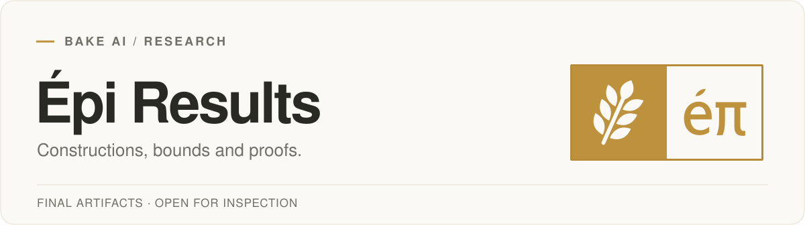
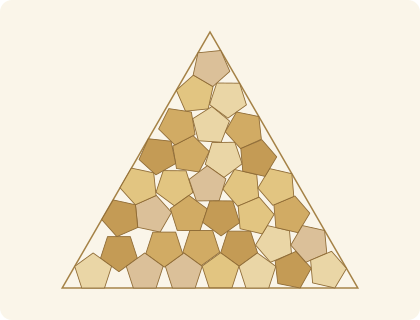
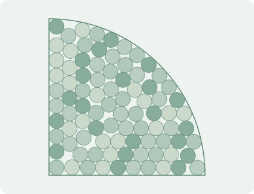
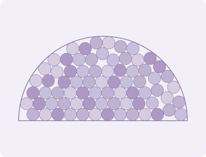
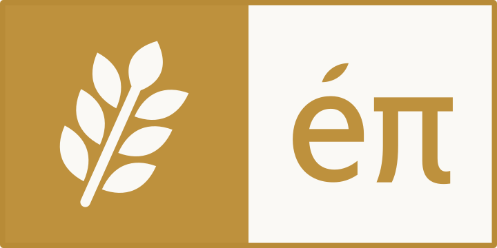

<picture>
  <source media="(prefers-color-scheme: dark)" srcset="assets/results-header-dark.svg">
  
</picture>

<p align="center">
  <a href="#selected-results">Selected results</a> &nbsp; / &nbsp;
  <a href="#constructions">Constructions</a> &nbsp; / &nbsp;
  <a href="#downloads">Downloads</a> &nbsp; / &nbsp;
  <a href="#citation">Cite</a> &nbsp; / &nbsp;
  <a href="https://bakeai.inc/research/articles/introducing-epi/">Introducing Épi ↗</a>
</p>

Épi is Bake AI’s autonomous research harness. This collection brings together its mathematical results and the artifacts behind them: explicit constructions, numerical witnesses and proofs.

<table>
<tr>
<td width="280" align="center" valign="top"><h2>20</h2>Numerical bound<br>records<br><br></td>
<td width="280" align="center" valign="top"><h2>1</h2>Theorem<br>extension<br><br></td>
<td width="280" align="center" valign="top"><h2>106</h2>Released<br>constructions<br><br></td>
</tr>
</table>

## Selected results

| Problem | Previous result | Épi | Explore |
| :-- | :-- | :-- | :-- |
| **Polyomino growth** | ≤ 4.5238 | **≤ 4.29569** | [Exact recurrence certificate](mathematics/klarner) |
| **n-queens constant** | Interval width 3.30 × 10⁻⁷ | **3.9367 × 10⁻⁹**, about 84× narrower | [Both endpoint witnesses](mathematics/nqueens) |
| **Water-network design** | Global lower bound 655.5441707 | **≥ 662.80702839** | [Proof bundle](mathematics/waterund36) |
| **Cohn–Elkies method** | Sharpness unresolved in dimensions 10 and 11 | **Non-sharp in both dimensions** | [Exact dual certificates](mathematics/cohn-elkies) |

### A theorem extension: Tuza’s inequality

Épi proved **τ△(G) ≤ 2ν△(G)** for a larger class of split graphs. The clique part has eight vertices; vertices in the independent part with at least two clique neighbors may now have **three distinct neighborhoods**, up from two. Each type can occur arbitrarily many times.

The proof combines a reduction with exact triangle covers and packings. The release includes the argument, its certificate and an independent checker.

[Read the proof](mathematics/tuza/PROOF.md) &nbsp; · &nbsp; [Inspect the certificate](mathematics/tuza) &nbsp; · &nbsp; [Run the checker](mathematics/tuza/verify.py)

<details>
<summary><strong>Explore all mathematical results</strong></summary>

| Area | Results |
| :-- | :-- |
| **Growth and entropy** | [Klarner’s constant](mathematics/klarner) · [Dimer constant](mathematics/dimer) · [n-queens asymptotics](mathematics/nqueens) |
| **Combinatorics** | [Wellens’ bound](mathematics/wellens) · [Spencer discrepancy](mathematics/spencer-discrepancy) · [Ramsey c₄,₅](mathematics/ramsey-c45) · [Bₕ[g] coefficients](mathematics/bhg) · [Tuza’s inequality](mathematics/tuza) |
| **Geometry and dynamics** | [Cohn–Elkies bounds](mathematics/cohn-elkies) · [Quartic Feigenbaum dimension](mathematics/feigenbaum) |
| **Optimization and information** | [MAX-4-CUT hardness](mathematics/max4cut) · [Water-network lower bound](mathematics/waterund36) · [Quantum-capacity thresholds](mathematics/quantum-capacity) |

[Full table of values and sources →](mathematics/README.md)

</details>

## Constructions

<table>
<tr>
<td width="33%" align="center"><a href="records/pentagons/penintri_n34"></a></td>
<td width="33%" align="center"><a href="records/circular-quadrant/pack_ccq_n87"></a></td>
<td width="33%" align="center"><a href="records/semicircle/pack_csc_n74"></a></td>
</tr>
<tr>
<td align="center"><strong>34</strong><br>pentagons<br><a href="records/pentagons/penintri_n34">Triangle</a></td>
<td align="center"><strong>87</strong><br>circles<br><a href="records/circular-quadrant/pack_ccq_n87">Quadrant</a></td>
<td align="center"><strong>74</strong><br>circles<br><a href="records/semicircle/pack_csc_n74">Semicircle</a></td>
</tr>
</table>

The figures are drawn from the released coordinates. Open a construction to see its value, comparison source and verification details.

<details>
<summary><strong>Browse all 106 constructions across 10 categories</strong></summary>

| Category | Entries | Objective |
| :-- | --: | :-- |
| [Circles in a quadrant](records/circular-quadrant) | 46 | Larger common radius |
| [Balls in four dimensions](records/four-dimensional-balls) | 36 | Larger common radius |
| [Circles in a semicircle](records/semicircle) | 9 | Larger common radius |
| [Pentagons in a triangle](records/pentagons) | 9 | Smaller enclosing triangle |
| [Circles in an octagon](records/octagon) | 1 | Larger common radius |
| [Vehicle routing](records/vehicle-routing) | 1 | Shorter feasible routes |
| [Spin-glass energy](records/spin-glass) | 1 | Lower energy for the specified instance |
| [Qubit routing](records/qubit-routing) | 1 | Fewer extra two-qubit gates across the same 61 circuits |
| [Third autocorrelation inequality](records/autocorrelation) | 1 | Smaller signed-convolution objective |
| [Zhang–Zagier essential minimum](records/zhang-zagier) | 1 | Smaller certified upper bound |

</details>

<details>
<summary><strong>Record standings and attribution</strong></summary>

| Current standing | Entries |
| :-- | --: |
| Improve the reviewed registry | **89** |
| Already listed records | **11** |
| Match the current registry precision | **1** |
| Have been superseded | **3** |
| Improve a named benchmark reference | **2** |

Friedman lists the nine pentagon constructions, credited to **Yue Huang**. CVRPLIB lists the vehicle-routing value; EinsteinArena lists the autocorrelation result under **Poolish**, the project’s former name.

Semicircle N = 159, 205 and 244 have been surpassed; N = 202 matches the latest published precision. Their final constructions remain available with their current standings.

</details>

## Downloads

| Collection | Files |
| :-- | :-- |
| **Constructions** | [CSV index](data/records.csv) · [JSON index](data/records.json) |
| **Mathematical results** | [Result pages](mathematics) · [JSON index](data/mathematics.json) |
| **Large certificates** | [Release v1.1.0](https://github.com/BakeLab/Epi-results/releases/tag/v1.1.0) |
| **File verification** | [Download sizes and SHA-256](data/downloads.json) · [Repository checksums](checksums.sha256) |

Small witnesses live alongside their result pages. The larger certificates are Release downloads, including the n-queens upper witness and water-network proof bundle, keeping the repository lightweight.

## Citation

```bibtex
@misc{epiteam2026results,
  author       = {{Epi Team}},
  title        = {{\'E}pi Results},
  year         = {2026},
  howpublished = {GitHub},
  url          = {https://github.com/BakeLab/Epi-results}
}
```

<sub>Comparisons last reviewed on September 11, 2026. If you know a stronger result, please [contact us](https://bakeai.inc/contact/).</sub>

---

<p align="center">
  <br>
  <strong>Bake AI · Épi</strong><br>
  <a href="https://bakeai.inc/research/articles/introducing-epi/">Read the research story ↗</a>
</p>
